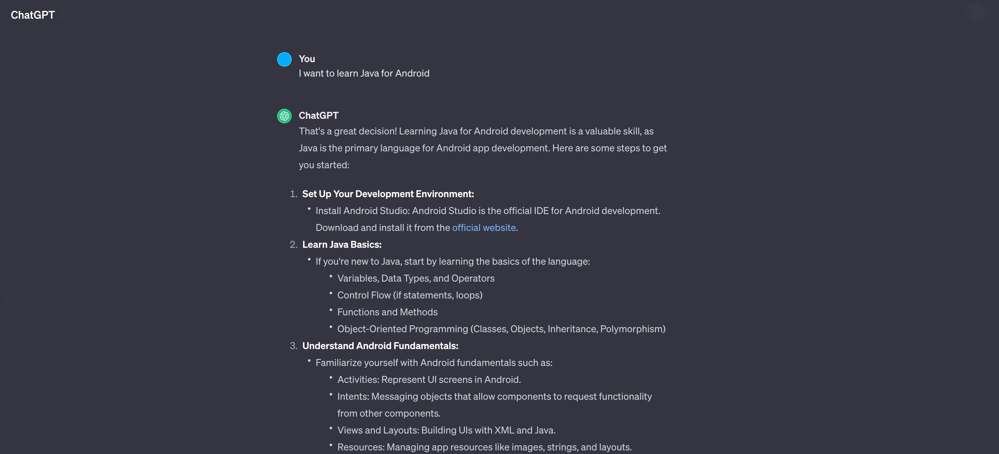
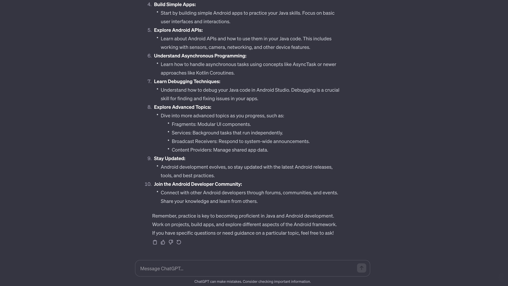
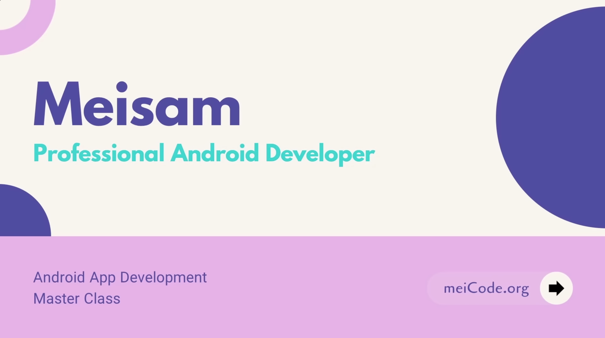
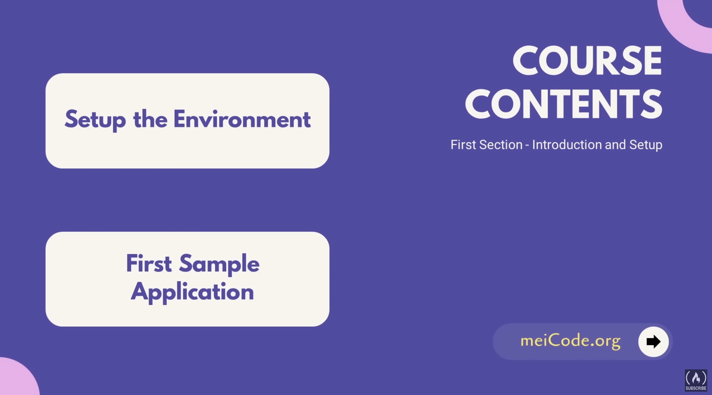
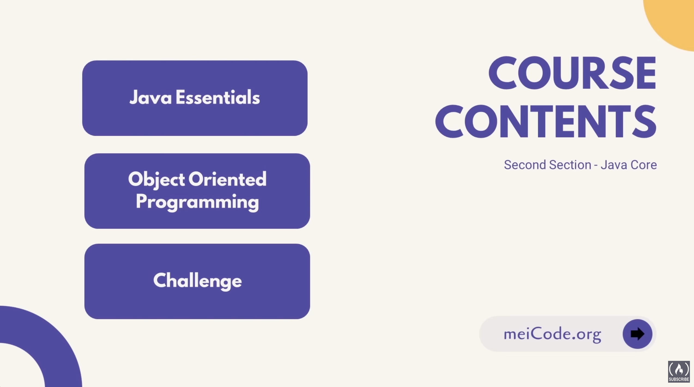
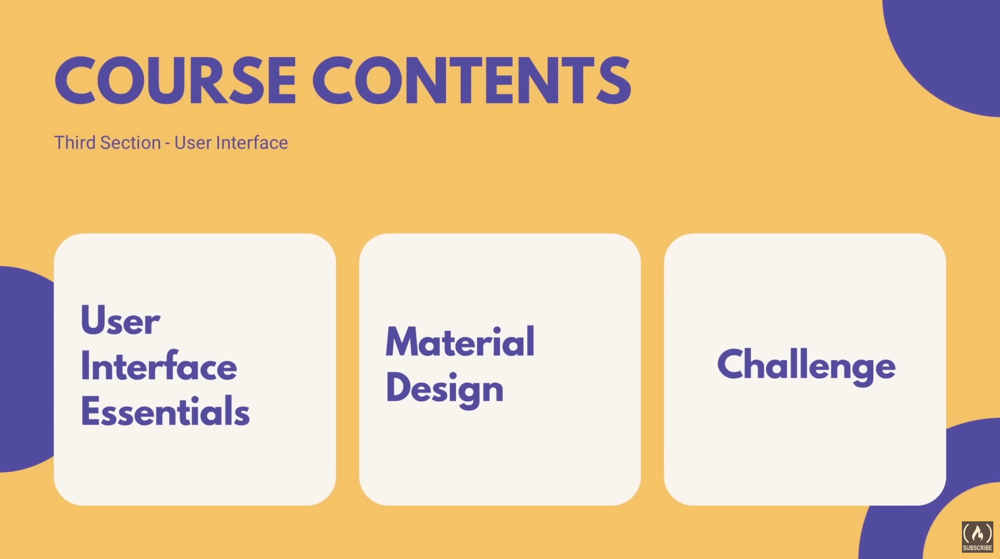
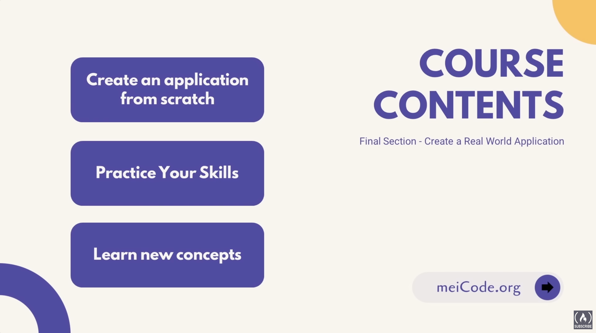

# Java Enthusiasts

This repository serves as a practice ground for honing my `Java` skills in the context of `Android` development. My plan is to leverage `ChatGPT` as a learning resource throughout this journey.

---

My initial plan is check my current skill sets according the list, then to practice and enhance the skills.

---

[Android Development for Beginners - Full Course](https://www.youtube.com/watch?v=fis26HvvDII&t=16774s)

Since we're working for a Java project, so we can start it in Android Studio directly.

1. Install Java SDK and configurtions
2. Install Android Studio and configuration and customize. We can also check it from official website to find some tutorials

3. Create a Android project

`⭐️ Course Contents ⭐️` 
⌨️ (0:00) Course Introduction 
⌨️ (3:12) Setup The Environment 
⌨️ (18:52) Create Your First Application (Part 1) 
⌨️ (43:53) Create Your First Application (Part 2) 
⌨️ (59:20) Challenge 
⌨️ (1:07:19) Variables and Arithmetic Operators 
⌨️ (1:31:12) Relational and Logical Operators) Conditional Statements 
⌨️ (1:47:43) Loops 
⌨️ (2:04:13) Challenge (Create a Game) 
⌨️ (2:16:00) Simple Arrays 
⌨️ (2:27:51) Object Oriented Programming (Part 1) 
⌨️ (2:49:30) Object Oriented Programming (Part 2) 
⌨️ (3:06:02) Object Oriented Programming (Part 3) 
⌨️ (3:19:41) OOP Challenge 
⌨️ (3:43:56) Collections in Java 
⌨️ (4:06:14) Static Keyword - Inner Classes 
⌨️ (4:17:04) Interfaces and Abstract Classes 
⌨️ (4:35:26) Concurrency - Exceptions 
⌨️ (4:46:05) Singleton Pattern 
⌨️ (4:56:00) Challenge (Part 1) 
⌨️ (5:18:16) Challenge (Part 2) 
⌨️ (5:39:40) User Interface Basics (Part 1) 
⌨️ (6:04:21) User Interface Basics (Part 2) 
⌨️ (6:33:09) User Interface Basics (Part 3) 
⌨️ (6:58:39) Layouts 
⌨️ (7:26:53) Images 
⌨️ (7:37:32) ListView and Spinner 
⌨️ (8:00:57) Different XML Files (Part 1) 
⌨️ (8:29:41) Different XML Files (Part 2) 
⌨️ (8:41:09) Material Design 
⌨️ (8:59:58) Snackbar and CardView 
⌨️ (9:16:51) RecyclerView (Part 1) 
⌨️ (9:39:02) RecyclerView (Part 2) 
⌨️ (10:03:50) RecyclerView (Part 3) 
⌨️ (10:22:26) Fonts 
⌨️ (10:38:35) Challenge (Part 1) 
⌨️ (10:57:16) Challenge (Part 2) 
⌨️ (10:13:18) Create App's First Page - Intents 